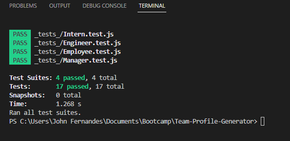

# Team-Profile-Generator

  ## Table of Content 📖
  - [Description](#description)
  - [Technologies](#technologies)
  - [User Story](#user-story)
  - [Acceptance Criteria](#acceptance-criteria)
  - [Installation](#installation)
  - [Credit](#credit)
  - [Terminal-Results](#terminal)
  - [Reach-me](#reach-me)
  - [GitHub-name](#github-name)
  - [Video-Link](#video-link)

## Description
The Team-Profile-Generator is a command-line-input application that run in Node. This application requests information from the user about Devlopment team members (like Manager, Engineer and Intern) and generates an HTML file displaying their information. 

The user can selects that member's role from a list (options include "Engineer," "Intern," and "Manager), The common input for the Manager, Engineer and Intern are "Name, Id and Email", based on the role the additional information will be collected from the user. If the user selects manager, additionally the office number has to be provided. For the Engineer the Github name has to be given. Similarly for the Intern the school name has to be provided. 

## Technologies
The application will give the overall team info within the organization. This app was created using Object-Oriented Programming concepts, namely using classes and constructors to create "team member" objects based on information entered by the user.  The app is run using Node.js, and uses the "Inquirer" and "FS" node modules, bootstrap, google fonts.  Files for different objects are also stored in separate .js files and passed among one another using module.exports and require.

## User Story

```md
AS A manager
I WANT to generate a webpage that displays my team's basic info
SO THAT I have quick access to their emails and GitHub profiles
```

## Acceptance Criteria

```md
GIVEN a command-line application that accepts user input
WHEN I am prompted for my team members and their information
THEN an HTML file is generated that displays a nicely formatted team roster based on user input
WHEN I click on an email address in the HTML
THEN my default email program opens and populates the TO field of the email with the address
WHEN I click on the GitHub username
THEN that GitHub profile opens in a new tab
WHEN I start the application
THEN I am prompted to enter the team manager’s name, employee ID, email address, and office number
WHEN I enter the team manager’s name, employee ID, email address, and office number
THEN I am presented with a menu with the option to add an engineer or an intern or to finish building my team
WHEN I select the engineer option
THEN I am prompted to enter the engineer’s name, ID, email, and GitHub username, and I am taken back to the menu
WHEN I select the intern option
THEN I am prompted to enter the intern’s name, ID, email, and school, and I am taken back to the menu
WHEN I decide to finish building my team
THEN I exit the application, and the HTML is generated
```

## Installation

VS code, Node js, npm Inquirer(inquirer@8.2.4.)packages.
Jest for running the unit tests and Inquirer for collecting input from the user.

## Credit

UW Bootcamp Instructors and TA's, Reference "https://getbootstrap.com/docs/5.2/getting-started/introduction/", https://www.w3docs.com/snippets/html/how-to-create-mailto-links.html, https://fonts.google.com/specimen/Open+Sans?preview.text=My%20Team&preview.text_type=custom.

## Terminal
The terminal which display the unit test results.


## Reach-me

jessyjosephine.mscit@gmail.com

## GitHub-name

Github: https://github.com/Jessyjdi

## Video-Link

https://drive.google.com/file/d/1ib9ozcxHqc4u9ePJt5wd7AFzq7jFsGjE/view


